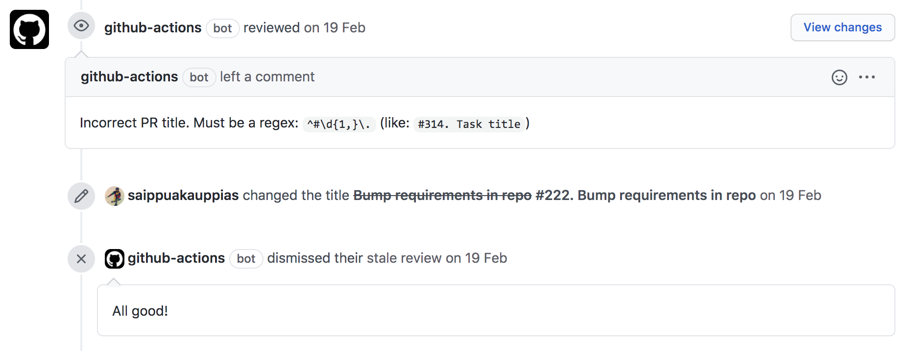

# Awesome GHA Snippets

A collection of useful snippets, all in one place.

**GitHub Actions** is a great CI/CD with many possibilities that can be used to solve the most non-trivial tasks. But some features are poorly documented or come with experience. The most interesting of the features will be reflected in this repository.

## 📚 Contents

* [Tips](#-tips)
  * [Secrets](#secrets)
  * [Action options](#action-options)
  * [Strict Error Mode (Shell)](#strict-error-mode-shell)
  * [Cache Dependencies](#cache-dependencies)
  * [Installing Dependencies in Node.js](#installing-dependencies-in-nodejs)
  * [Marketplace Actions](#marketplace-actions)
* [Snippets](#-snippets)
  * [Notify on Error](#notify-on-error)
  * [Commit History (aka Release Notes)](#commit-history-aka-release-notes)
  * [Passing Variables Between Steps](#passing-variables-between-steps)
  * [Publish Package on PyPI](#publish-package-on-pypi)
  * [Publish Docker Image](#publish-docker-image)
  * [Check PR Title](#check-pr-title)

## 📌 Tips

### Secrets

If your repository is in an organization (not a personal repo), **always** store the [secret keys](https://docs.github.com/en/actions/reference/encrypted-secrets) in the organization settings.
<details>
<summary>They are available at the URL:</summary>

```
https://github.com/organizations/[ORG_SLUG]/settings/secrets/actions
```
</details>

**Avoid** adding secrets to the repository settings as this will cause them to be duplicated in the future, which will "shoot" at the most inopportune moment (at the time of release).

If you add secrets in the organization, it is possible to manage accesses (`Repository access` –> `Selected repositories`) and quickly revoke/change if necessary for all repos.

_Remark:_ You can painlessly move all the secrets from the repositories to the organization level, as their names do not change (but do not forget to remove the secrets from the repository settings).

### Action options

Each `action` from the marketplace contains an `action.yml` or `action.yaml` file at the root of its repository, which may contain directives within it:
1. `inputs` – input parameters with their description and default values.
2. `outputs` – names of variables through which action will return result.

### Strict Error Mode (Shell)

When using the `run` directive in steps – try to use the strict error control setting [`set -euo pipefail`](https://explainshell.com/explain?cmd=set+-euo+pipefail) on the first line.

If you don't like this approach, at least use `shell: bash` in this step, since the [command shell](https://docs.github.com/en/actions/reference/workflow-syntax-for-github-actions#using-a-specific-shell) will be used when you start it:
```shell
bash --noprofile --norc -eo pipefail {0}
```

If these two directives are missing – the shell will be started without full strict error control (which can lead to unpredictable results in case of problems):
```shell
shell: /usr/bin/bash -e {0}
```

_Note_: this applies to Linux distributions.

### Cache Dependencies

Always use caching of dependencies with [cache action](https://github.com/actions/cache) – this speeds up the execution of the workflow.

Look at the [usage examples](https://github.com/actions/cache/blob/main/examples.md) for your package manager.

### Installing Dependencies in Node.js

In the githab workflow for projects using Node.js, always prefer install dependencies using command [`npm ci`](https://docs.npmjs.com/cli/v7/commands/npm-ci) rather than `npm install` – it speeds up execution time a lot.

Together with dependency caching for large projects, you can achieve amazing acceleration. Be sure to read the documentation.

### Marketplace Actions

Try not to use actions that are not versioned and require a `master`/`main` version to be installed. This is at least unsafe and may cause your workflow to crash, in case of major changes.

Many actions are not optimized and run a lot of stuff inside them (especially if they use a docker), which slows down the execution process. If you need to perform some trivial tasks that fit into a few commands, prefer to use your simple implementation, or at least make sure that the action won't be slower than you are allowed by the limits.

## 🛠 Snippets

### Notify on Error

If the workflow crashes or is cancelled, a notification will be sent to Slack channel with the name of the repository and a link to the CI/CD log.

```yaml
jobs:
  deploy:
    runs-on: ubuntu-latest
    steps:
      - name: Notify on Error
        if: ${{ failure() || cancelled() }}
        shell: bash
        run: |
          MESSAGE="❌ ${GITHUB_REPOSITORY##*/} deploy has been failed: https://github.com/${GITHUB_REPOSITORY}/actions/runs/${GITHUB_RUN_ID}"
          # send message to Slack
          curl -X POST --data-urlencode "payload={\"channel\": \"#releases\", \"username\": \"GitHub Actions\", \"text\": \"${MESSAGE}\"}" https://hooks.slack.com/services/${{ secrets.SLACK_WEBHOOK_TOKEN }}
```

### Commit History (aka Release Notes)

Sending the commit history from a published release to Slack channel along with the release notification. Commits are taken as the difference between the previous tag and the current one.

**Requirements:**
1. Releases are published by setting a new tag.
2. All tags must begin with the letter `v`.
3. Tags must be named according to [semver](https://semver.org/).
4. To get tags inside the workflow, you need to set `fetch-depth: 0` in the `actions/checkout` action.

```yaml
on:
  push:
    tags:
      - 'v*'
jobs:
  deploy:
    runs-on: ubuntu-latest
    steps:
      - name: Checkout
        uses: actions/checkout@v2
        with:
          # download tags along with the repository to get the commit history
          fetch-depth: 0
      - name: Publish Commit History
        shell: bash
        run: |
          # previous release tag
          TAG_FROM=$(git tag | egrep '^v([0-9]+\.[0-9]+\.[0-9]+)$' | sort -V | tail -n 2 | head -n 1)
          HISTORY=$(git show -s --reverse --format='• %s' "${TAG_FROM}...${GITHUB_REF##*/}" | tr '\"' "'" | tr '\`' "'" | python -c 'import sys; print(sys.stdin.read().replace("\n", "\\n"))')
          MESSAGE="🎉 ${GITHUB_REPOSITORY##*/} release ${GITHUB_REF##*/} has been deployed:"
          # send message with history to Slack
          curl -X POST --data-urlencode "payload={\"channel\": \"#releases\", \"username\": \"GitHub Actions\", \"blocks\": [{\"type\": \"section\", \"text\": {\"type\": \"mrkdwn\", \"text\": \"${MESSAGE}\"}}, {\"type\": \"section\", \"text\": {\"type\": \"mrkdwn\", \"text\": \"\`\`\`${HISTORY}\`\`\`\"}}]}" https://hooks.slack.com/services/${{ secrets.SLACK_WEBHOOK_TOKEN }}
```

### Passing Variables Between Steps

With this method you can pass (transfer) variable values (output of some command) between steps.

**Note:** it is better to encode the values using base64, so that if there are newlines in the output, nothing is lost.

```yaml
jobs:
  deploy:
    runs-on: ubuntu-latest
    steps:
      - name: Create Variable
        id: create_var
        shell: bash
        run: |
          DATA="some long message received when executing the some command"
          DATA64=$(echo "${DATA}" | base64 -w 0)
          echo "::set-output name=RESULT::${DATA64}"
      - name: Get Variable
        shell: bash
        run: |
          DATA=$(echo "${{ steps.create_var.outputs.RESULT }}" | base64 -d)
          echo "${DATA}"
```

### Publish Package on PyPI

After creating a new package release, you can automatically publish the new build in [Python Package Index](https://pypi.org/).

**Requirements:**
1. To start a workflow, you need to create a new release in the repository.
2. In the secret keys, `PYPI_USERNAME` and `PYPI_PASSWORD` must be added for access to PyPI.

```yaml
on:
  release:
    types: [published]
jobs:
  publish_pypi:
    runs-on: ubuntu-latest
    steps:
      - uses: actions/checkout@v2
      - uses: actions/setup-python@v2
        with:
          python-version: '3.x'
      - name: Install Dependencies
        run: |
          python -m pip install --upgrade pip
          pip install setuptools wheel twine
      - name: Build and Publish
        shell: bash
        env:
          TWINE_REPOSITORY: pypi
          TWINE_USERNAME: ${{ secrets.PYPI_USERNAME }}
          TWINE_PASSWORD: ${{ secrets.PYPI_PASSWORD }}
        run: |
          python setup.py sdist bdist_wheel
          twine upload dist/*
```

### Publish Docker Image

After creating a new release, you can automatically add the image to the docker hub (update `latest` tag and add new).

**Requirements:**
1. To start a workflow, you need to create a new release in the repository.
2. You need to change `[USERNAME_OR_ORG]` to the name of the profile or organization. For example: `textdatasetcleaner` for https://hub.docker.com/u/textdatasetcleaner
3. You need to change `[IMAGE_NAME]` to repository (image name). For example: `tdc` for https://hub.docker.com/r/textdatasetcleaner/tdc
4. In the secret keys, `DOCKER_HUB_USERNAME` and `DOCKER_HUB_TOKEN` ([managing tokens](https://docs.docker.com/docker-hub/access-tokens/)) must be added for access to Docker Hub.

```yaml
on:
  release:
    types: [published]
jobs:
  publish_docker:
    runs-on: ubuntu-latest
    steps:
      - uses: actions/checkout@v2
      - name: Build the Docker Image
        shell: bash
        run: |
          docker build -t [USERNAME_OR_ORG]/[IMAGE_NAME]:${GITHUB_REF##*/} -t [USERNAME_OR_ORG]/[IMAGE_NAME]:latest .
      - name: Push Built Image Into Registry
        shell: bash
        run: |
          echo "${{ secrets.DOCKER_HUB_TOKEN }}" | docker login docker.io --username "${{ secrets.DOCKER_HUB_USERNAME }}" --password-stdin
          docker push [USERNAME_OR_ORG]/[IMAGE_NAME]
```

### Check PR Title

Fast check of PR title with reject/accept review and comment from bot using [linter](https://github.com/morrisoncole/pr-lint-action).


```yaml
name: Check PR title
on:
  pull_request:
    types: [opened, edited, reopened]
jobs:
  pr-lint:
    runs-on: ubuntu-latest
    steps:
      - uses: morrisoncole/pr-lint-action@v1.5.0
        with:
          title-regex: "^#\\d{1,}\\."
          on-failed-regex-fail-action: true
          on-failed-regex-request-changes: true
          on-failed-regex-create-review: true
          on-failed-regex-comment: "Incorrect PR title. Must be a regex: `%regex%` (like: `#314. Task title`)"
          repo-token: "${{ secrets.GITHUB_TOKEN }}"
```

<details>
<summary>Checking regex in the browser console (DevTools)</summary>

```javascript
r = new RegExp("^#\\d{1,}\\.");
!r.test('#123: aa') && r.test('#1.') && !r.test('#12345678: abc') && !r.test('12345678: a') && !r.test('#12345678 a') && r.test('#12345678. a');
// Output: true
```
</details>
